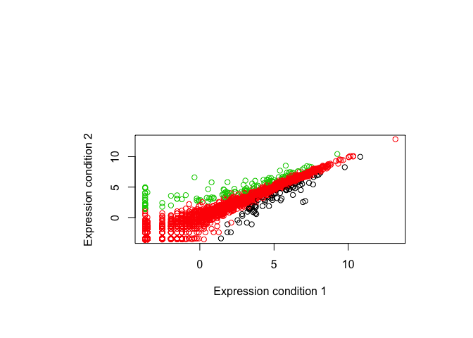

Lecture\_05
================
Haoming
2019-11-01

``` r
#Lecture 5 Data visualization
#2A
weight <- read.table("bimm143_05_rstats/weight_chart.txt", header=TRUE)
plot(weight$Age, weight$Weight, typ="o", 
     pch=15, cex=1.5, lwd=2, ylim=c(2,10), 
     xlab="Age (months)", ylab="Weight (kg)", 
     main="Baby weight with age", col="blue") 
```

<!-- -->

``` r
# 2B
mouse <- read.table("bimm143_05_rstats/feature_counts.txt", 
                    sep="\t", header=TRUE)
par(mar=c(3.1, 11.1, 9, 2))
barplot(mouse$Count, names.arg=mouse$Feature, 
        horiz=TRUE, ylab="", 
        main="Number of features in the mouse GRCm38 genome", 
        las=1, xlim=c(0,80000))
```

<!-- -->

``` r
#2C
x <- c(rnorm(10000),rnorm(10000)+4)
hist(x, breaks=10)
```

<!-- -->

``` r
#3A
par(mar=c(7, 10, 10, 5))
mf <- read.delim("bimm143_05_rstats/male_female_counts.txt")
barplot(mf$Count, names.arg=mf$Sample, col=rainbow(nrow(mf)),las=2, ylab="Counts")
```

<!-- -->

``` r
barplot(mf$Count, names.arg=mf$Sample, col=c("blue2","red2"), 
        las=2, ylab="Counts")
```

<!-- -->

``` r
#3B
genes <- read.delim("bimm143_05_rstats/up_down_expression.txt")
nrow(genes)
```

    ## [1] 5196

``` r
table(genes$State)
```

    ## 
    ##       down unchanging         up 
    ##         72       4997        127

``` r
plot(genes$Condition1, genes$Condition2, col=genes$State, 
     xlab="Expression condition 1", ylab="Expression condition 2")
```

<!-- -->

``` r
palette(c("blue","gray","red"))
plot(genes$Condition1, genes$Condition2, col=genes$State, 
     xlab="Expression condition 1", ylab="Expression condition 2")
```

<!-- -->

``` r
#3C
meth <- read.delim("bimm143_05_rstats/expression_methylation.txt")
nrow(meth)
```

    ## [1] 9241

``` r
plot(meth$gene.meth, meth$expression)
```

<!-- -->

``` r
dcols <- densCols(meth$gene.meth, meth$expression)
plot(meth$gene.meth, meth$expression, col = dcols, pch = 20)
```

<!-- -->

``` r
inds <- meth$expression > 0
plot(meth$gene.meth[inds], meth$expression[inds])
```

<!-- -->

``` r
dcols <- densCols(meth$gene.meth[inds], meth$expression[inds])
plot(meth$gene.meth[inds], meth$expression[inds], col = dcols, pch = 20)
```

<!-- -->

``` r
dcols.custom <- densCols(meth$gene.meth[inds], meth$expression[inds],
                         colramp = colorRampPalette(c("blue2",
                                                      "green2",
                                                      "red2",
                                                      "yellow")) )
plot(meth$gene.meth[inds], meth$expression[inds], 
     col = dcols.custom, pch = 20)
```

<!-- -->
