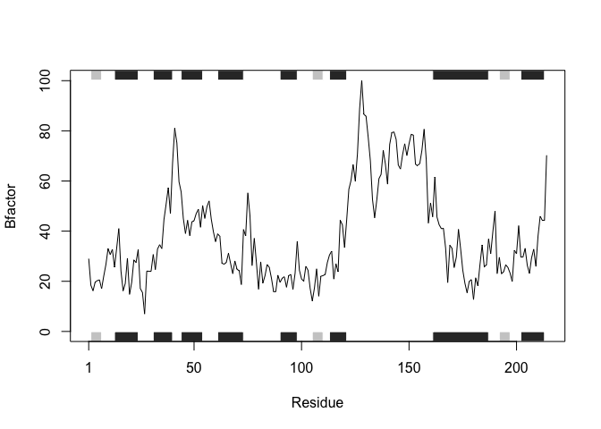
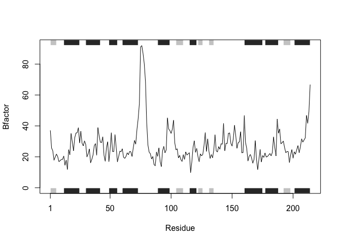

Lecture\_6 R Functions
================
Howard Wang
10/18/2019

``` r
read.table("test1.txt", header=TRUE, sep=",")
```

    ##   Col1 Col2 Col3
    ## 1    1    2    3
    ## 2    4    5    6
    ## 3    7    8    9
    ## 4    a    b    c

``` r
read.table("test2.txt", header=TRUE, sep="$")
```

    ##   Col1 Col2 Col3
    ## 1    1    2    3
    ## 2    4    5    6
    ## 3    7    8    9
    ## 4    a    b    c

``` r
read.table("test3.txt", header=FALSE, sep="")
```

    ##   V1 V2 V3
    ## 1  1  6  a
    ## 2  2  7  b
    ## 3  3  8  c
    ## 4  4  9  d
    ## 5  5 10  e

our first silly function

``` r
add <- function(x, y = 1){
  # Sum the input x and y
  x + y
}
```

``` r
add(5,5)
```

    ## [1] 10

``` r
rescale1 <- function(x) {
  rng <-range(x) 
  (x - rng[1]) / (rng[2] - rng[1]) 
  }
```

``` r
rescale2 <- function(x) { 
  rng <-range(x, na.rm=TRUE) 
  (x - rng[1]) / (rng[2] - rng[1]) 
}
```

``` r
rescale <- function(x, na.rm=TRUE, plot=FALSE) {
  if(na.rm) { 
    rng <-range(x, na.rm=na.rm) 
    } else { 
      rng <- range(x)
      } 
  print("Hello") 
  answer <- (x - rng[1]) / (rng[2] - rng[1]) 
  print("is it me you are looking for?") 
  if(plot) { 
    plot(answer, typ="b", lwd=4) 
    } 
  print("I can see it in ...")
}
```

``` r
rescale(1:10, plot=TRUE)
```

    ## [1] "Hello"
    ## [1] "is it me you are looking for?"

<!-- -->

    ## [1] "I can see it in ..."

Install the bio3d package with

``` r
#install.packages("bio3d")
```

``` r
library(bio3d)
s1 <- read.pdb("4AKE")
```

    ##   Note: Accessing on-line PDB file

``` r
# kinase with drug
s2 <- read.pdb("1AKE")
```

    ##   Note: Accessing on-line PDB file
    ##    PDB has ALT records, taking A only, rm.alt=TRUE

``` r
# kinase no drug
s3 <- read.pdb("1E4Y")
```

    ##   Note: Accessing on-line PDB file

``` r
# kinase with drug
s1.chainA <- trim.pdb(s1, chain="A", elety="CA")
s2.chainA <- trim.pdb(s2, chain="A", elety="CA")
s3.chainA <- trim.pdb(s3, chain="A", elety="CA")

s1.b <- s1.chainA$atom$b
s2.b <- s2.chainA$atom$b
s3.b <- s3.chainA$atom$b

plotb3(s1.b, sse=s1.chainA, typ="l", ylab="Bfactor")
```

<!-- -->

``` r
plotb3(s2.b, sse=s2.chainA, typ="l", ylab="Bfactor")
```

<!-- -->

``` r
plotb3(s3.b, sse=s3.chainA, typ="l", ylab="Bfactor")
```

<!-- -->

Question
6

``` r
# Plot a standard scatter plot with optional secondary structure in the marginal regions
plot.Ab <- function(x){
  # checking the input is character or not
  if (is.character(x)==1){
    # checking the nummber of the character is 4 or not
    if(nchar(x)==4){
     # Read a Protein Data Bank (PDB) coordinate file.
     s <- read.pdb(x)
     # Produce a new smaller PDB object, containing a subset of atoms, from a given      larger PDB object.
     s.chainA <- trim.pdb(s, chain="A", elety="CA")
     # taking the vector b from list of atom of s.chainA
     s.b <- s.chainA$atom$b
     # Plot the data
     plotb3(s.b, sse=s.chainA, typ="l", ylab="Bfactor")
    } else{
      # remind to put 4 characters of PDB identifier
      print("Please enter four characters PDB identifier")
    }
  } else {
    # remind to put correct PDB identifier
    print("Please check your PDB identifier")
  }
}
```

``` r
plot.Ab("1AKE")
```

    ##   Note: Accessing on-line PDB file

    ## Warning in get.pdb(file, path = tempdir(), verbose = FALSE): /var/folders/
    ## 18/bqb77w6j39735d4rb2wz_8580000gn/T//RtmpjxLgl1/1AKE.pdb exists. Skipping
    ## download

    ##    PDB has ALT records, taking A only, rm.alt=TRUE

<!-- -->
