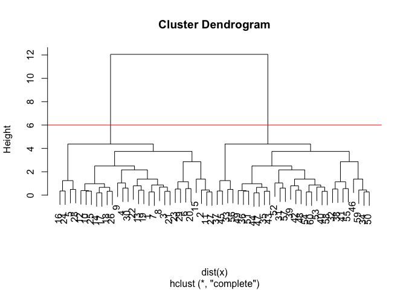
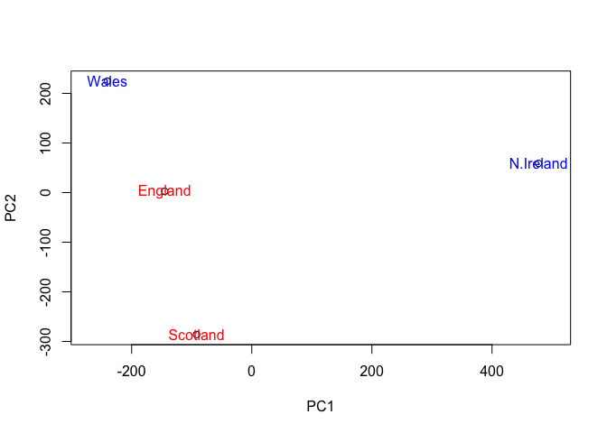

Lecture\_8
================
Howard Wang
10/25/2019

\#k-menas

``` r
tmp <- c(rnorm(30,-3), rnorm(30,3)) 
x <- cbind(x=tmp, y=rev(tmp))

plot(x)
```

<!-- -->

``` r
k <- kmeans(x, centers = 2, nstart = 20)
```

``` r
plot(x, col = k$cluster)
points(k$centers, col = "blue")
```

<!-- -->

## Hierarchical clustering

``` r
hc <- hclust (dist(x))
```

``` r
plot(hc)
abline(h = 6, col = "red")
```

<!-- -->

``` r
grps <- cutree(hc, h = 4)
plot (x, col = grps)
```

<!-- -->

``` r
x <- rbind(
matrix(rnorm(100, mean=0, sd = 0.3), ncol = 2), 
matrix(rnorm(100, mean = 1, sd = 0.3), ncol = 2), 
matrix(c(rnorm(50, mean = 1, sd = 0.3), 
        rnorm(50, mean = 0, sd = 0.3)), ncol = 2))
colnames(x) <- c("x", "y")
plot(x)
```

<!-- -->

``` r
col <- as.factor( rep(c("c1","c2","c3"), each=50) )

plot(x, col=col)
```

<!-- -->

``` r
x <- rbind(
matrix(rnorm(100, mean=0, sd = 0.3), ncol = 2), 
matrix(rnorm(100, mean = 1, sd = 0.3), ncol = 2), 
matrix(c(rnorm(50, mean = 1, sd = 0.3), 
        rnorm(50, mean = 0, sd = 0.3)), ncol = 2))
colnames(x) <- c("x", "y")
hc <- hclust(dist(x))
plot(hc)
```

<!-- -->

``` r
grps <- cutree(hc, k = 3)
plot(x, col=grps)
```

<!-- -->

``` r
mydata <- read.csv("https://tinyurl.com/expression-CSV", row.names=1)
head(mydata)
```

    ##        wt1 wt2  wt3  wt4 wt5 ko1 ko2 ko3 ko4 ko5
    ## gene1  439 458  408  429 420  90  88  86  90  93
    ## gene2  219 200  204  210 187 427 423 434 433 426
    ## gene3 1006 989 1030 1017 973 252 237 238 226 210
    ## gene4  783 792  829  856 760 849 856 835 885 894
    ## gene5  181 249  204  244 225 277 305 272 270 279
    ## gene6  460 502  491  491 493 612 594 577 618 638

``` r
pca <- prcomp(t(mydata), scale=TRUE)
attributes(pca)
```

    ## $names
    ## [1] "sdev"     "rotation" "center"   "scale"    "x"       
    ## 
    ## $class
    ## [1] "prcomp"

``` r
plot(pca$x[,1], pca$x[,2])
```

<!-- -->

``` r
pca.var <- pca$sdev^2 
pca.var.per <- round(pca.var/sum(pca.var)*100, 1)
barplot(pca.var.per, main="Scree Plot",
xlab="Principal Component", ylab="Percent Variation")
```

<!-- -->

``` r
x <- read.csv("https://bioboot.github.io/bggn213_f17/class-material/UK_foods.csv", row.names=1)
barplot(as.matrix(x), beside=F, col=rainbow(nrow(x)))
```

<!-- -->

``` r
pairs(x, col=rainbow(10), pch=16)
```

<!-- -->

``` r
pca <- prcomp( t(x) )
summary(pca)
```

    ## Importance of components:
    ##                             PC1      PC2      PC3       PC4
    ## Standard deviation     324.1502 212.7478 73.87622 4.189e-14
    ## Proportion of Variance   0.6744   0.2905  0.03503 0.000e+00
    ## Cumulative Proportion    0.6744   0.9650  1.00000 1.000e+00

``` r
plot(pca$x[,1:2], xlab="PC1", ylab="PC2", xlim=c(-270,500))
text(pca$x[,1], pca$x[,2], colnames(x), col = c("red", "blue"))
```

<!-- -->
