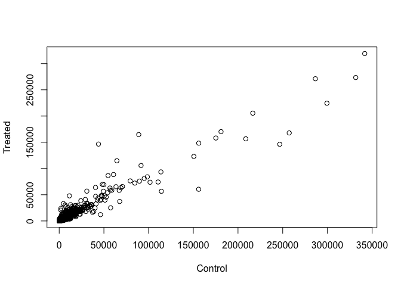

Transcriptomics and the analysis of RNA-Seq data
================

# Setup bioconductor DESeq2

``` r
install.packages("BiocManager")
BiocManager::install()
# For this class, you'll also need DESeq2:
BiocManager::install("DESeq2")
```

# Data for today’s class

``` r
counts <- read.csv("airway_scaledcounts.csv", stringsAsFactors = FALSE)
metadata <-  read.csv("airway_metadata.csv", stringsAsFactors = FALSE)
```

\#Now, take a look at
    each

``` r
head(counts)
```

    ##           ensgene SRR1039508 SRR1039509 SRR1039512 SRR1039513 SRR1039516
    ## 1 ENSG00000000003        723        486        904        445       1170
    ## 2 ENSG00000000005          0          0          0          0          0
    ## 3 ENSG00000000419        467        523        616        371        582
    ## 4 ENSG00000000457        347        258        364        237        318
    ## 5 ENSG00000000460         96         81         73         66        118
    ## 6 ENSG00000000938          0          0          1          0          2
    ##   SRR1039517 SRR1039520 SRR1039521
    ## 1       1097        806        604
    ## 2          0          0          0
    ## 3        781        417        509
    ## 4        447        330        324
    ## 5         94        102         74
    ## 6          0          0          0

``` r
head(metadata)
```

    ##           id     dex celltype     geo_id
    ## 1 SRR1039508 control   N61311 GSM1275862
    ## 2 SRR1039509 treated   N61311 GSM1275863
    ## 3 SRR1039512 control  N052611 GSM1275866
    ## 4 SRR1039513 treated  N052611 GSM1275867
    ## 5 SRR1039516 control  N080611 GSM1275870
    ## 6 SRR1039517 treated  N080611 GSM1275871

# How many genes are in this dataset?

``` r
nrow(counts)
```

    ## [1] 38694

``` r
ncol(counts)-1
```

    ## [1] 8

# Lets make sure metadata id col match the conames of counts

``` r
# function all is useful for looking values of all true
all(colnames(counts)[-1]==metadata$id)
```

    ## [1] TRUE

# Analysis: compare the control to drug treated

\#First we need to access the columns of out countDara that are control
and then find their mean

``` r
control <- metadata[metadata[,"dex"]=="control",]
control.mean <- rowSums( counts[ ,control$id] )/length(control$id)
names(control.mean) <- counts$ensgene
```

\#Second we need to access the columns of out countDara that are treated
and then find their mean

``` r
treated <- metadata[metadata[,"dex"]=="treated",]
treated.mean <- rowSums( counts[ ,treated$id] )/length(treated$id)
names(treated.mean) <- counts$ensgene
```

# We will combine our meancount data for bookkeeping purposes.

``` r
meancounts <- data.frame(control.mean, treated.mean)
plot(meancounts[,1],meancounts[,2], xlab="Control", ylab="Treated")
```

<!-- -->

# Plot in a log scale

``` r
plot(meancounts[,1],meancounts[,2], xlab="Control", ylab="Treated", log="xy")
```

    ## Warning in xy.coords(x, y, xlabel, ylabel, log): 15032 x values <= 0
    ## omitted from logarithmic plot

    ## Warning in xy.coords(x, y, xlabel, ylabel, log): 15281 y values <= 0
    ## omitted from logarithmic plot

<!-- -->

## Fold change

``` r
meancounts$log2fc <- log2(meancounts[,"treated.mean"]/meancounts[,"control.mean"])
head(meancounts)
```

    ##                 control.mean treated.mean      log2fc
    ## ENSG00000000003       900.75       658.00 -0.45303916
    ## ENSG00000000005         0.00         0.00         NaN
    ## ENSG00000000419       520.50       546.00  0.06900279
    ## ENSG00000000457       339.75       316.50 -0.10226805
    ## ENSG00000000460        97.25        78.75 -0.30441833
    ## ENSG00000000938         0.75         0.00        -Inf

\#There are a couple of “weird” results. Namely, the NaN (“not a
number”) and -Inf (negative infinity) results.

\#The NaN is returned when you divide by zero and try to take the log.
The -Inf is returned when you try to take the log of zero. It turns out
that there are a lot of genes with zero expression. Let’s filter our
data to remove these genes. Again inspect your result (and the
intermediate steps) to see if things make sense to you

``` r
zero.vals <- which(meancounts[,1:2]==0, arr.ind=TRUE)
to.rm <- unique(zero.vals[,1])
mycounts <- meancounts[-to.rm,]
nrow(mycounts)
```

    ## [1] 21817

<!-- A common threshold used for calling something differentially expressed is a log2(FoldChange) of greater than 2 or less than -2. Let’s filter the dataset both ways to see how many genes are up or down-regulated. -->

``` r
up.ind <- mycounts$log2fc > 2
sum(up.ind)
```

    ## [1] 250

``` r
down.ind <- mycounts$log2fc < (-2)
sum(down.ind)
```

    ## [1] 367

<!-- Adding annotation data -->

``` r
BiocManager::install("AnnotationDbi")
BiocManager::install("org.Hs.eg.db")
library("AnnotationDbi")
library("org.Hs.eg.db")
```
